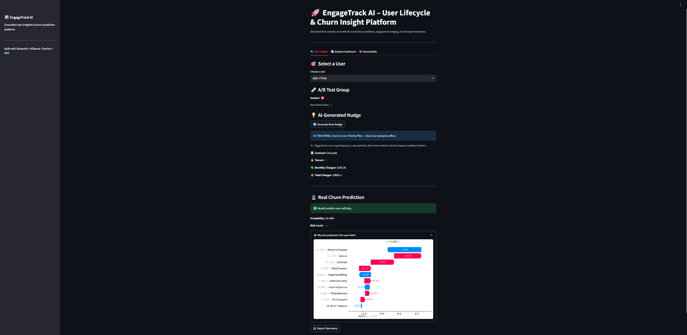
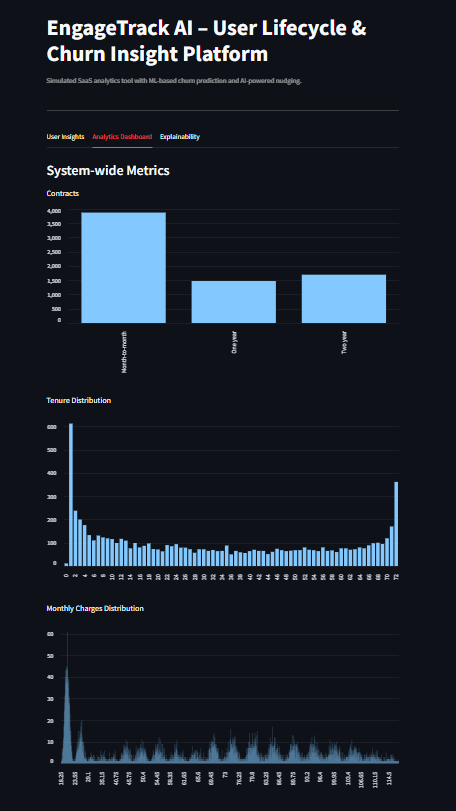
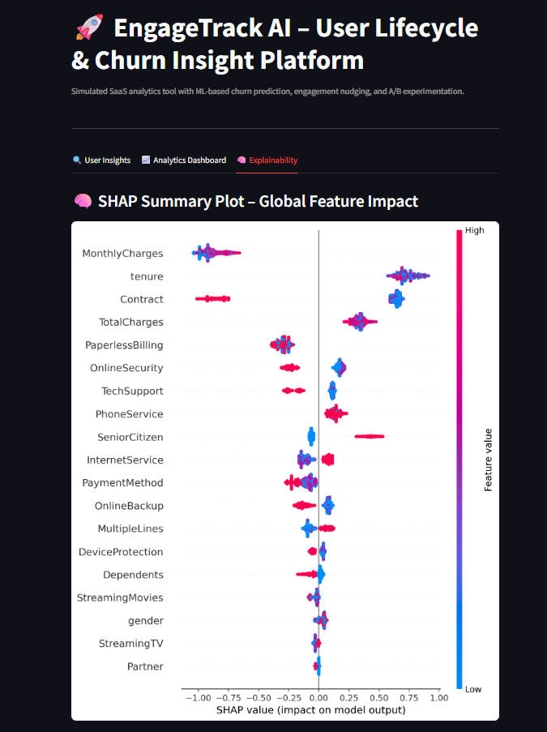

# 📊 EngageTrack AI – Smart Productivity Insights

**EngageTrack AI** is a simulated SaaS product analytics platform that visualizes user lifecycle insights, churn risk, engagement levels, and delivers AI-powered nudges. It mimics how modern AI-enabled SaaS platforms use behavioral signals and personalization to drive engagement.

Built with **Streamlit + XGBoost + Docker + GitHub Actions + Azure AKS**, this project showcases **product strategy, DevOps maturity, and full-stack delivery**.

---

## 🌐 Live Demo

▶️ **Try it now:** [http://172.171.188.153/](http://172.171.188.153/)  
> No login required – select a user to view insights instantly

---

## 🚀 Features

- ✅ Real churn prediction using XGBoost (Telco dataset)
- ✅ AI-generated nudges via rule-based mock API
- ✅ Per-user churn probability with risk level
- ✅ A/B variant assignment stored in `churn.csv`
- ✅ SHAP explainability visualization (global summary)
- ✅ One-click user summary export (TXT)
- ✅ Logs lifecycle activity to `/tmp/usage.log`
- ✅ Dashboard with contract, delay, engagement, variants
- ✅ Clean Streamlit UI with tabs and sidebar branding
- ✅ Fully Dockerized + CI/CD to AKS
---

## 📦 Tech Stack

| Layer         | Tech Used                                 |
|---------------|--------------------------------------------|
| UI / Frontend | Streamlit                                 |
| ML Model      | XGBoost (binary churn classifier)         |
| Preprocessing | Pandas, LabelEncoder, StandardScaler      |
| Backend       | Modular Python (`src/` architecture)      |
| DevOps        | Docker, GitHub Actions, Azure AKS         |
| Infra         | NGINX ingress, AKS LoadBalancer           |
| Dataset       | Telco Customer Churn (IBM Sample)         |

---

## 🖼 Screenshots

### 🔍 User Overview


### 📊 Dashboard Visuals


### 📊 SHAP Plot



## 📂 Folder Structure

```bash
EngageTrack-AI/
├── src/ # Streamlit App & Modules
│ ├── app.py  
│ ├── data_loader.py  
│ ├── mock_api.py  
│ ├── recommendation_engine.py  
│  
├── logs/ # Logs are redirected to /tmp in cloud  
│  
├── data/ # Input data  
│ └── churn.csv       # Updated Telco dataset with variant column
│  
├── notebooks/
│ └── churn_model.ipynb
│
├── logs/            # Runtime logs (redirected to /tmp in prod)
│
├── docs/ # Documentation  
│   ├── PRD.md
│   ├── Features.md
│   ├── Help_Center.md
│   └── Release_Notes.md
│  
├── Dockerfile  
├── requirements.txt  
├── Security.md  
├── docker-compose.yml  
├── engagetrack-deploy.yaml  
├── engagetrack-ingress.yaml  
├── engagetrack-service.yaml  
├── nginx.conf  
├── .gitignore
├── .dockerignore
└── README.md  
```
---

## ▶️ How to Run

### 🔧 Option 1: Local (without Docker)
```bash
pip install -r requirements.txt
streamlit run src/app.py
```

### 🐳 Option 2: Dockerized
```bash
docker build -t engagetrack .
docker run -p 8501:8501 engagetrack
```
  
🌐 Visit the app: [http://localhost:8501](http://localhost:8501)

---

## 🧠 System Logic
```bash
Select user ID →
    ↳ Load metadata (contract, delay, calls, etc.)
    ↳ Predict churn via XGBoost (trained model)
    ↳ Display churn probability and risk level
    ↳ Generate nudge via rule-based logic
    ↳ Allow user summary download
    ↳ Log interaction to /tmp/usage.log
```
✅ Payment Delay is log-transformed  
✅ Categorical fields encoded with LabelEncoder  
✅ SHAP values shown in Explainability tab  
✅ Variant A/B logic handled if column exists
---

## 📊 Dashboard Insights

🔥 **Usage Frequency Distribution**  
🧮 **Contract Type Distribution**  
📞 **Support Call Frequency**  
⏳ **Payment Delay Breakdown**  
🧪 **A/B Variant Assignment**

---

## 🧪 A/B Testing Support

- Users are randomly tagged with A/B via assign_variants.py
- Variant shows in user insights and dashboard
- Demonstrates simple experimentation workflow

---

## 📄 Export & Logging

✅ Per-user summary export as .txt  
✅ Logs user activity to /tmp/usage.log (container-safe)

---

## 🔐 Security Highlights

- Runs under a non-root Docker user
- Redirected logs to /tmp/ (write-safe in Docker)
- No secrets or credentials pushed
- .gitignore covers logs, system files, and config
- NGINX + IP controls + rate limiting available  

See Security.md for full details.

---

## 🧪 Model Explainability

A Jupyter notebook with:  

- ✅ Churn model training (XGBoost)
- ✅ ROC curve and confusion matrix
- ✅ SHAP global explainability plot

File: notebooks/churn_model.ipynb

---

## 📄 Docs & Support Files

PRD.md – Product Requirements Document

- Features.md – Detailed feature overview  
- Help_Center.md – UI usage instructions  
- Security.md – Security best practices

---

## 💼 Built By

Tanesh Singhal  
MS Business Analytics @ University of Cincinnati  
📌 Product • DevOps • AI Strategy

---

## 📄 License

MIT License — Free to use, fork, and extend for educational or demo purposes.

