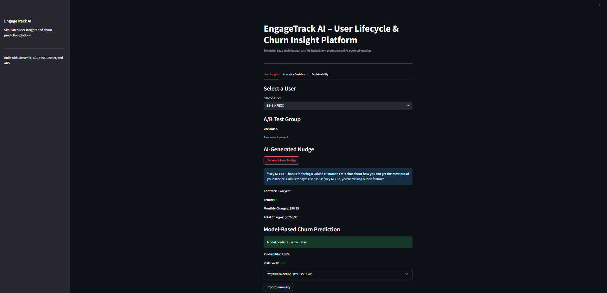

# 📊 EngageTrack AI – Smart Productivity Insights

**EngageTrack AI** is a simulated SaaS analytics platform that visualizes user lifecycle insights, churn risk, engagement levels, and delivers real LLM–powered nudges. It mimics how modern AI-enabled SaaS products use behavioral signals and personalization to drive retention.

Built with **Streamlit + XGBoost + Together AI + Docker + GitHub Actions + Azure AKS**, this project showcases **product strategy, full-stack ML, explainability, and DevOps maturity**.

---

## 🌐 Live Demo

▶️ **Try it now:** [http://172.171.188.153/](http://172.171.188.153/)  
> No login required – select a user to view insights instantly

---

## 🚀 Features

- ✅ Real churn prediction using **XGBoost** (Telco dataset)  
- ✅ **AI-generated nudges** via Together AI Mixtral-8x7B model (`src/nudge_api.py`)  
- ✅ Per-user churn probability with risk level  
- ✅ A/B variant assignment in `data/churn.csv`  
- ✅ **Per-user SHAP waterfall plots** under “Why this prediction?” 
- ✅ SHAP global explainability visualization  
- ✅ One-click user summary export (TXT)  
- ✅ Secure logging to `logs/usage.log` (tracked via `.gitkeep`)  
- ✅ Dashboard charts for contract, tenure, charges, support calls, variant, churn rate  
- ✅ Clean Streamlit UI with tabs and sidebar  
- ✅ Fully Dockerized + CI/CD → AKS  

---

## 📦 Tech Stack

| Layer             | Tech Used                                                |
|-------------------|----------------------------------------------------------|
| Frontend / UI     | Streamlit                                                |
| ML Model          | XGBoost                                                  |
| LLM Nudges        | Together AI Mixtral-8x7B via REST (`requests`, `dotenv`) |
| Explainability    | SHAP                                                      |
| Backend           | Python modular (`src/app.py`, `src/data_loader.py`, `src/nudge_api.py`) |
| Containerization  | Docker, Docker Compose                                   |
| CI/CD             | GitHub Actions                                           |
| Orchestration     | Azure Kubernetes Service (AKS)                           |
| Ingress / Network | NGINX Ingress + Azure Load Balancer                      |
| Dataset           | IBM Telco Customer Churn + `variant` column              |
---

## 🖼 Screenshots

### 🔍 User Overview


### 📊 Dashboard Visuals


### 📊 SHAP Plot


## 📂 Folder Structure

```bash
EngageTrack-AI/
├── data/ # Input data  
│ └── churn.csv       # Updated Telco dataset with variant column
├── logs/
│   └── .gitkeep             # Keeps logs/ in Git; actual usage.log is ignored
├── notebooks/
│   └── churn_model.ipynb    # Training & explainability notebook
├── src/ # Streamlit App & Modules
│ ├── app.py  
│ ├── data_loader.py  
│ ├── nudge_api.py  
│ └── recommendation_engine.py
├── docs/
│   ├── PRD.md
│   ├── Features.md
│   ├── Help_Center.md
│   ├── Security.md
│   └── Release_Notes.md
├── Dockerfile  
├── requirements.txt 
├── docker-compose.yml  
├── engagetrack-deploy.yaml  
├── engagetrack-ingress.yaml  
├── engagetrack-service.yaml  
├── nginx.conf  
├── .gitignore
├── .dockerignore
└── README.md  
```
---

## ▶️ How to Run

### 🔧 Option 1: Local (without Docker)
```bash
pip install -r requirements.txt
streamlit run src/app.py
```

### 🐳 Option 2: Dockerized
```bash
docker build -t engagetrack-ai .
docker run -p 8501:8501 engagetrack-ai
# then browse http://localhost:8501
```
---

## 🧠 System Logic
```bash
Select user → load profile (including A/B variant)
  ↳ Preprocess features (encode, scale, log-transform)
  ↳ Predict churn (XGBoost + SHAP)
  ↳ Generate nudge (Together AI)
  ↳ Display churn probability & per-user SHAP waterfall
  ↳ Export summary and append log
```
---

## 📊 Dashboard Insights

🔥 **Usage Frequency Distribution**  
🧮 **Contract Type Distribution**  
📞 **Support Call Frequency**  
⏳ **Payment Delay Breakdown**  
🧪 **A/B Variant Assignment**  
❌ **Churn Rate by Variant**  

---

## 🧪 A/B Testing Support

- Users are assigned A or B via the variant column in data/churn.csv  
- Variants appear in both the User Insights view and the Dashboard  
- Demonstrates a simple experimentation workflow

---

## 📄 Export & Logging

✅ Per-user summary export as .txt  
✅ Logs user activity to logs/usage.log (directory tracked via .gitkeep)


---

## 🧪 Model Explainability

A Jupyter notebook with:  

- ✅ Churn model training (XGBoost)
- ✅ ROC curve and confusion matrix
- ✅ SHAP global explainability plot

File: notebooks/churn_model.ipynb

---

## 📄 Docs & Support Files

- PRD.md – Product Requirements Document  
- Features.md – Detailed feature overview  
- Help_Center.md – UI usage instructions  
- Security.md – Security best practices  
- Release_Notes.md – Version history & releases  

---

## 🔐 Security Highlights

- Runs as a non-root Docker user
- Logs written to logs/usage.log (directory persisted via .gitkeep, log file ignored)
- No secrets or credentials in repo
- .gitignore and .dockerignore protect sensitive files
- GINX ingress supports rate limiting and TLS

See docs/Security.md for full details.

---

## 💼 Built By

Tanesh Singhal  
MS Business Analytics @ University of Cincinnati  
📌 Product • DevOps • AI Strategy

---

## 📄 License

MIT License — Free to use, fork, and extend for educational or demo purposes.

